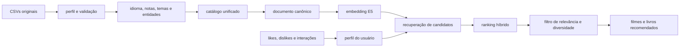

# Reel & Read — preferências de filmes e livros

O **Reel & Read** é um projeto de sistema de recomendação para livros e filmes. A aplicação permite explorar um catálogo unificado, registrar likes e dislikes e receber recomendações personalizadas e explicáveis.

O objetivo principal não é apenas sugerir obras semanticamente parecidas. O projeto investiga o ciclo completo de um recomendador: seleção e tratamento das bases, criação de uma taxonomia comum, geração de embeddings, construção do perfil de gosto, filtragem colaborativa, ranking híbrido, diversidade, cold start, explicabilidade, versionamento e avaliação de um ranker neural.

## Visão geral

| Dado | Quantidade |
| --- | ---: |
| Livros | 6.810 |
| Filmes | 1.999 |
| Total de obras | 8.809 |
| Autores distintos | 4.470 |
| Categorias compartilhadas | 19 |
| Dimensões por embedding | 384 |
| Embeddings ativos | 8.809 |
| Esquema de features ativo | `hybrid-features-v5` |

O projeto usa:

- **Angular 22** na interface;
- **NestJS 12** na API REST;
- **PostgreSQL 17 com pgvector** para catálogo, preferências, vetores e resultados materializados;
- **Python e Sentence Transformers** no worker de embeddings e recomendação;
- **`intfloat/multilingual-e5-small`** como modelo multilíngue de 384 dimensões;
- **TensorFlow/Keras** no ranker neural de duas torres, ativado somente quando houver dados e ganho mensurável.

## Da base até a recomendação



### 1. Preparação dos dados

As fontes de livros e filmes possuem idiomas, escalas de nota e taxonomias diferentes. Por isso, os arquivos originais são preservados e uma pipeline reproduzível:

- estima idiomas ausentes;
- normaliza somente as notas dos livros para a escala de 0 a 10;
- extrai temas e entidades sem substituir o texto original;
- reduz 567 categorias de livros para as 19 categorias compartilhadas do TMDB;
- valida esquema, tipos, faixas, JSON e integridade antes de publicar os CSVs processados.

Ausências continuam ausências. O sistema não inventa descrição, autor ou nota para tornar o catálogo artificialmente completo.

### 2. Embeddings e perfil de gosto

Cada obra é convertida em um documento canônico rotulado, formado por título, subtítulo, autores, idioma, categorias, descrição, temas e entidades. Nota, popularidade, ano, quantidade de votos e URL da imagem ficam fora do embedding e permanecem como features estruturadas ou dados de apresentação.

Os documentos são codificados pelo E5 no mesmo espaço vetorial, permitindo comparar livro com livro, filme com filme e também atravessar as duas mídias. Os embeddings são normalizados, versionados e reutilizados quando o hash do conteúdo não muda.

O perfil vetorial do usuário é calculado por:

```text
perfil = normalizar(média dos likes - 0,35 × média dos dislikes)
```

Sem likes, o sistema não inventa um centro de gosto. Nesse caso, usa estratégias de fallback baseadas em qualidade, popularidade e exclusões.

### 3. Recuperação e ranking híbrido

O worker recupera até 600 candidatos e então aplica um ranking mais rico. Os sinais positivos da versão atual são:

| Sinal | Peso |
| --- | ---: |
| Universo ou franquia | 24% |
| Categoria | 17% |
| Tema ou palavra-chave | 17% |
| Personagem ou entidade | 17% |
| Usuários semelhantes | 12% |
| Qualidade ajustada pela confiança | 5% |
| Centro de gosto | 4% |
| Like individual mais próximo | 4% |

Dislikes também geram penalidades explícitas por proximidade semântica e por conflitos de franquia, categoria, tema, entidade e colaboração. Isso evita que uma coincidência textual isolada recomende, por exemplo, terror para alguém que demonstrou preferência por animações infantis.

Universos e franquias recebem o maior peso. Os termos do título são normalizados e só são considerados quando também aparecem nas entidades da obra, reduzindo falsos positivos com palavras genéricas. Assim, `Narnia` e `Nárnia` podem ser conectados de forma explicável.

### 4. Usuários semelhantes, diversidade e explicações

O sinal colaborativo compara os vetores de gosto, não os dados demográficos. Um perfil é vizinho quando alcança pelo menos 65% de similaridade de cosseno, e são considerados no máximo 25 vizinhos. Likes e dislikes desses perfis são agregados com suavização; nenhum nome, ID ou histórico de outra pessoa é exposto.

As explicações exibidas vêm dos componentes reais do score, por exemplo:

- “Porque você curtiu The Chronicles of Narnia”;
- “Tema em comum: magia”;
- “Personagem ou entidade em comum: Harry Potter”;
- “Usuários parecidos com você gostaram disto”.

Depois do ranking, o sistema reduz repetições de categoria, franquia e mídia. A diversidade só reorganiza candidatos relevantes: itens com menos de 40% do melhor score do trilho são descartados antes dessa etapa.

### 5. Cold start e evolução neural

O recomendador adapta a estratégia à quantidade de sinais disponíveis:

| Situação | Estratégia |
| --- | --- |
| Nenhum like ou dislike | popularidade e qualidade diversificadas |
| Somente dislikes | exclusão e penalização, solicitando sinais positivos |
| Um ou dois likes | vizinhos das obras curtidas |
| Três ou mais likes | centro de gosto, vizinhos e ranking híbrido |
| Ranker neural aprovado | combinação de 70% do baseline e 30% do modelo neural |

O ranker de duas torres recebe o histórico vetorial do usuário, uma faixa etária por década com baixa magnitude, o embedding do item e features estruturadas. Cidade, profissão, nacionalidade, gênero e orientação sexual não entram no ranking.

O treinamento neural exige pelo menos 1.000 interações elegíveis e 100 usuários ativos. Os dados são divididos no tempo, evitando que o item-alvo apareça no histórico usado para prevê-lo. Um candidato só é promovido se superar o baseline em pelo menos `0,01` de `NDCG@10` ou `Precision@10`; caso contrário, o ranking híbrido continua ativo.

## Estrutura

```text
movies-and-books-recomendations/
├── compose.yaml
├── .env.example
├── csv/
│   ├── Original_Books.csv
│   ├── Original_TMDB_movies.csv
│   ├── Books.csv
│   └── TMDB_movies.csv
├── database/
│   ├── init/
│   │   ├── 01_create_schemas.sql
│   │   ├── 02_create_staging_tables.sql
│   │   ├── 03_create_catalog_tables.sql
│   │   ├── 04_create_indexes.sql
│   │   ├── 05_create_views.sql
│   │   └── 06_create_user_preferences.sql
│   ├── migrations/              # upgrades reaplicáveis de bancos existentes
│   └── load/
│       └── 01_reload_all.sql
├── docs/
│   ├── data-model.md
│   ├── data-profile.md
│   └── import.md
├── artigo/                   # série técnica sobre o recomendador
├── scripts/
│   ├── download_tmdb.py
│   ├── estimate_languages.py
│   ├── normalize_ratings.py
│   ├── extract_keywords_llm.py
│   ├── validate_processed_data.py
│   ├── run_data_pipeline.sh
│   ├── extract_book_keywords.py
│   ├── extract_movie_keywords.py
│   ├── extract_keywords.sh
│   └── load_database.sh
├── backend/
│   ├── src/                  # API REST e casos de uso
│   └── recommendation-worker/ # embeddings, perfis e ranking offline
├── frontend/                 # interface Angular
├── deploy/                   # CronJob Kubernetes do recomendador
└── README.MD
```

## Pré-requisitos

- Docker Engine;
- Docker Compose v2 (`docker compose`);
- Node.js 22 ou superior e npm;
- Python 3.10 ou superior para coletar e preparar os dados;
- conta e **API Read Access Token** do TMDB apenas para uma nova coleta;
- Codex CLI instalado e autenticado para gerar idioma e keywords.

## Executar a aplicação

Na raiz do projeto, inicie o PostgreSQL:

```bash
docker compose up -d
docker compose ps
```

Em um volume novo, todos os arquivos de `database/init` são aplicados automaticamente. Para atualizar um volume existente sem apagar usuários ou preferências:

```bash
./scripts/migrate_database.sh
```

Se o catálogo ainda estiver vazio, carregue os CSVs com `./scripts/load_database.sh`.

Inicie a API em um terminal:

```bash
cd backend
npm install
npm run start:dev
```

Inicie a interface em outro terminal:

```bash
cd frontend
npm install
npm start
```

A interface fica em `http://localhost:4200` e a API em `http://localhost:3000`. O backend aceita as variáveis `DB_HOST`, `DB_PORT`, `DB_NAME`, `DB_USER`, `DB_PASSWORD`, `DB_POOL_SIZE`, `DB_SSL`, `PORT` e `CORS_ORIGINS`.

Validações disponíveis:

```bash
cd backend
npm run build
npm run lint
npm test

cd ../frontend
npm run build
npm test -- --watch=false
```

### API REST

| Método           | Rota                                       | Operação                                    |
| ---------------- | ------------------------------------------ | ------------------------------------------- |
| `GET`            | `/movies` e `/movies/:id`                  | listar e detalhar filmes                    |
| `GET`            | `/books` e `/books/:id`                    | listar e detalhar livros                    |
| `GET`            | `/categories`                              | listar categorias compartilhadas            |
| `GET` / `POST`   | `/users`                                   | listar e cadastrar usuários                 |
| `GET`            | `/users/:id`                               | detalhar um usuário com idade calculada     |
| `GET`            | `/users/:id/preferences`                   | carregar preferências do usuário            |
| `PUT` / `DELETE` | `/users/:userId/movies/:itemId/preference` | definir ou remover preferência de filme     |
| `PUT` / `DELETE` | `/users/:userId/books/:itemId/preference`  | definir ou remover preferência de livro     |
| `GET`            | `/users/:userId/recommendations`           | filmes, livros ou descoberta entre mídias   |
| `GET`            | `/users/:userId/preference-summary`        | perfil de gosto e preferências enriquecidas |
| `GET`            | `/items/:type/:itemId/similar`             | similaridade dentro ou entre mídias         |
| `GET`            | `/recommendation/status`                   | versão ativa e estado do último job         |
| `POST`           | `/users/:userId/interactions`              | registrar impressões e abertura de detalhes |

As listagens aceitam `page`, `pageSize`, `query` e `categoryId`. O frontend acessa somente a API; não há conexão direta com o PostgreSQL.

## Iniciar o banco

Na raiz deste projeto:

```bash
docker compose up -d
docker compose ps
```

O serviço usa a imagem versionada `pgvector/pgvector:0.8.1-pg17-bookworm`, volume persistente, verificação de saúde e monta `csv/` como somente leitura em `/imports`.

Valores padrão para desenvolvimento:

| Variável            | Padrão                |
| ------------------- | --------------------- |
| `POSTGRES_DB`       | `recommendations`     |
| `POSTGRES_USER`     | `recommendations`     |
| `POSTGRES_PASSWORD` | `recommendations_dev` |
| `POSTGRES_PORT`     | `5432`                |

Copie `.env.example` para `.env` para alterar esses valores. Troque a senha antes de usar fora de um ambiente local e não publique a porta do banco na internet.

## Preparar e carregar os CSVs

As fontes `Original_*.csv` são imutáveis. Confirme que o Codex instalado está autenticado e gere todos os campos derivados em ordem:

```bash
codex --version
codex login # execute apenas se ainda não houver uma sessão autenticada
```

```bash
./scripts/run_data_pipeline.sh
```

A pipeline estima idiomas ausentes, normaliza somente as notas dos livros para 0–10, extrai keywords por `gpt-5.6-luna` com esforço `medium`, valida o resultado e então publica `Books.csv` e `TMDB_movies.csv`. As inferências são executadas com `codex exec`, sem ler `OPENAI_API_KEY` do `.env`. Respostas válidas são mantidas num cache local ignorado pelo Git.

Execute na raiz do projeto:

```bash
./scripts/load_database.sh
```

O script confere a presença dos CSVs, inicia o PostgreSQL caso necessário, aguarda o banco ficar disponível e solicita confirmação antes de substituir os dados atuais. Para uma execução não interativa:

```bash
./scripts/load_database.sh --yes
```

Também é possível executar o SQL diretamente com o banco já iniciado:

```bash
docker compose exec -T postgres \
  psql -U recommendations -d recommendations \
  < database/load/01_reload_all.sql
```

Esse script carrega os dois arquivos em uma única transação. Ele é destrutivo: esvazia staging, catálogo e preferências. Em produção, é um seed de execução única, não uma rotina de atualização.

Resultado esperado para os arquivos atuais:

| Relação                   | Registros |
| ------------------------- | --------: |
| `staging.books_csv`       |     6.810 |
| `staging.tmdb_movies_csv` |     1.999 |
| `catalog.books`           |     6.810 |
| `catalog.movies`          |     1.999 |
| `catalog.authors`         |     4.470 |
| `catalog.categories`      |        19 |
| Livros classificados      |     6.711 |

Consulte o procedimento completo em [`docs/import.md`](docs/import.md).

## Modelo de dados

O banco tem quatro schemas com responsabilidades separadas:

- `staging`: espelha as 14 colunas processadas de livros e as 21 de filmes como texto;
- `catalog`: converte tipos, armazena `keywords` como `JSONB`, padroniza atributos equivalentes e usa uma única taxonomia de categorias para livros e filmes.
- `app`: armazena usuários e preferências transacionais com integridade referencial para o catálogo.
- `recommendation`: versiona modelos, execuções, embeddings, perfis vetoriais e resultados materializados.

As tabelas centrais são `catalog.books` e `catalog.movies`. Ambas usam `original_language`, `description`, `keywords`, `release_year`, `average_rating`, `ratings_count` e `image_url`. As notas estão na escala comum de 0–10. A tabela `catalog.categories` contém as 19 categorias do TMDB e é compartilhada pelos dois tipos de item. As 567 categorias originais dos livros são reduzidas a essa taxonomia por regras auditáveis. Índices GIN permitem filtrar itens por entidade ou tema usando contenção JSONB.

A view `catalog.recommendation_items` entrega uma linha por obra com ID interno, `type`, `category_ids`, descrição, títulos, autores, idioma, temas, entidades, sinais de qualidade e completude. `categorie_ids` permanece apenas como alias temporário para compatibilidade.

Documentação:

- [modelo e diagrama entidade-relacionamento](docs/data-model.md);
- [perfil e qualidade dos arquivos](docs/data-profile.md);
- [carga e consultas de conferência](docs/import.md).
- [recomendações e operação do worker](docs/recommendations.md).

## Atualizar os filmes pelo TMDB

Crie ou acesse uma conta no [TMDB](https://www.themoviedb.org/), solicite acesso à API e copie o valor **API Read Access Token**. Prepare o ambiente:

```bash
cp .env.example .env
```

Preencha o token somente no arquivo local:

```dotenv
TMDB_READ_ACCESS_TOKEN=seu_token_bearer
```

`.env` é ignorado pelo Git. A autenticação segue a [documentação oficial do TMDB](https://developer.themoviedb.org/docs/authentication-application).

Para substituir a fonte original atual por uma nova coleta de aproximadamente 2.000 filmes:

```bash
python3 scripts/download_tmdb.py --overwrite
```

O coletor:

- usa o endpoint Discover com idioma `pt-BR` e região `BR`;
- elimina duplicidades por `tmdb_id`;
- por padrão mantém apenas filmes com pôster;
- consulta a configuração oficial de imagens;
- produz URLs de pôster `w500` e backdrop `w780`;
- trata erros transitórios e respostas `429`;
- grava o CSV de forma atômica.

Opções disponíveis:

```bash
python3 scripts/download_tmdb.py --help
```

O máximo aceito é 500 páginas, ou aproximadamente 10.000 resultados:

```bash
python3 scripts/download_tmdb.py --pages 500 --overwrite
```

Depois de atualizar a fonte, refaça toda a preparação e só então carregue o banco:

```bash
./scripts/run_data_pipeline.sh
./scripts/load_database.sh
```

O catálogo exige pôster; portanto, não use `--include-without-poster` com o modelo atual.

## Operação

```bash
# Abrir o psql
docker compose exec postgres psql -U recommendations -d recommendations

# Acompanhar logs
docker compose logs -f postgres

# Parar sem excluir dados
docker compose stop

# Remover o contêiner e manter o volume
docker compose down
```

Os scripts em `database/init` são executados somente quando o volume é criado. Para reconstruir um ambiente local vazio, veja o aviso de remoção de dados em [`docs/import.md`](docs/import.md).

## Uso dos dados do TMDB

O uso de dados e imagens deve respeitar os termos do TMDB. A interface deve seguir os requisitos de atribuição descritos na [FAQ oficial](https://developer.themoviedb.org/docs/faq), inclusive o aviso exigido:

> This product uses the TMDB API but is not endorsed or certified by TMDB.

## Recomendações

Execute o worker manualmente após aplicar as migrations:

```bash
docker compose --profile worker build recommendation-worker
docker compose --profile worker run --rm recommendation-worker
```

Até a primeira conclusão do worker, a API oferece fallback por popularidade e qualidade. Depois, usa embeddings compartilhados entre livros e filmes, perfis formados por likes e dislikes, ranking híbrido, diversidade e explicações determinísticas. A aba Minhas Preferências em `/catalog` mostra as escolhas e dois trilhos de recomendação — filmes e livros — navegáveis por setas.

Consulte [a arquitetura e o guia operacional](docs/recommendations.md).
