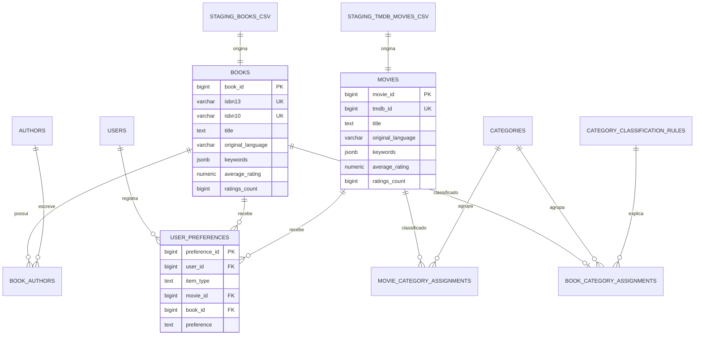

# Modelo de dados

O banco separa três responsabilidades:

- `staging`: recebe o texto dos CSVs processados sem conversões prematuras;
- `catalog`: converte tipos e organiza livros, filmes, autores, categorias e sinais semânticos;
- `app`: guarda usuários e preferências transacionais.

Os arquivos `Original_*.csv` não entram diretamente no PostgreSQL. Primeiro passam pela pipeline documentada em [import.md](import.md).

## Visão geral



## Padronização entre mídias

| Conceito | Livro | Filme | Regra no catálogo |
|---|---|---|---|
| ID da fonte | `isbn13` | `tmdb_id` | preservado como texto nas views |
| Idioma | estimado do título | informado pelo TMDB ou estimado se vazio | `original_language` ISO 639-1 |
| Descrição | `description` | `overview` | `description` |
| Nota | `average_rating` 0–5 | `vote_average` 0–10 | `average_rating` 0–10 |
| Votos | `ratings_count` | `vote_count` | `ratings_count` |
| Imagem | `thumbnail` | `poster_url` | `image_url` |
| Sinais semânticos | gerados por LLM | gerados por LLM | `keywords` JSONB |

Normalizar as notas antes da carga evita que uma recomendação mista compare 4,5 de 5 com 8 de 10 como se 8 fosse necessariamente melhor. Para uma nota conhecida de livro:

```text
nota_livro_0_a_10 = nota_livro_0_a_5 × 2
```

O cálculo é reversível e a fonte original continua disponível. Notas ausentes permanecem `NULL`.

## Idioma

`catalog.books.original_language` e `catalog.movies.original_language` são obrigatórios e aceitam códigos minúsculos de duas letras.

Nos filmes, o valor da fonte é preservado. A estimativa pelo modelo só acontece se uma coleta futura trouxer o campo vazio. Nos livros, o idioma é inferido de `title` e `subtitle`; por isso ele é um sinal probabilístico, não um dado bibliográfico confirmado.

## Keywords

Cada item possui:

```json
{
  "entidades": ["Hogwarts", "Harry Potter"],
  "temas": ["magia", "amizade"]
}
```

O valor é produzido pelo `gpt-5.6-luna`, com esforço `medium`, a partir de título e descrição. A extração não usa regex. O banco garante:

- objeto com exatamente `entidades` e `temas`;
- arrays de strings;
- no máximo 8 entidades e 6 temas;
- valor obrigatório, ainda que ambos os arrays estejam vazios.

Índices GIN permitem filtros de contenção:

```sql
SELECT item_type, title
FROM catalog.items
WHERE keywords @> '{"temas": ["magia"]}'::JSONB;
```

## Categorias

As 19 categorias do TMDB formam a taxonomia compartilhada. Filmes mantêm todos os seus gêneros. Cada livro é associado a no máximo uma categoria por regras ordenadas guardadas em `catalog.category_classification_rules`.

Essas regras ainda usam expressões regulares sobre o rótulo da categoria original. Isso não contradiz a decisão sobre keywords: regex continua adequada para converter um vocabulário conhecido e auditável; ela foi retirada da interpretação semântica de textos livres.

Cada associação de livro preserva:

- a categoria original;
- a regra aplicada;
- a categoria de destino.

## Views unificadas

### `catalog.items`

Expõe livros e filmes com as mesmas colunas:

- tipo, IDs interno e externo;
- título, idioma e descrição;
- keywords;
- ano;
- nota e quantidade de avaliações;
- `rating_scale`, agora sempre 10;
- imagem e ID da linha de staging.

### `catalog.recommendation_items`

É o contrato canônico de entrada do recomendador:

| Coluna | Significado |
|---|---|
| `item_id` / `source_id` | ID interno e ISBN-13 ou TMDB ID |
| `type` | `BOOK` ou `MOVIE` |
| `category_ids` | categorias compartilhadas; `categorie_ids` é o alias legado temporário |
| `title` | título do item |
| `subtitle` / `original_title` | títulos complementares próprios de cada mídia |
| `original_language` | idioma disponível ou estimado |
| `authors` / `original_category` | contexto editorial dos livros |
| `description` | descrição usada no documento canônico |
| `entidades` / `temas` | arrays derivados de `keywords` |
| `year` | ano de publicação ou lançamento |
| `vote_average` | nota comum de 0 a 10 |
| `vote_count` | quantidade de avaliações |
| `popularity` / `image_url` | sinais separados de ranking e apresentação |
| `content_completeness` | proporção de campos semânticos disponíveis |

Notas, votos, popularidade e imagem ficam fora do embedding e podem ser usados separadamente no ranking.

## Usuários e preferências

`app.user_preferences` guarda uma escolha atual `LIKE` ou `DISLIKE` por usuário e item. Uma restrição garante que cada linha referencie um filme ou um livro, nunca ambos. Índices únicos impedem duas preferências para o mesmo par usuário/item.

O seed `01_reload_all.sql` trunca preferências, eventos e todos os artefatos derivados de recomendação antes do catálogo. Por isso ele é destinado à inicialização única, antes de existirem dados de produção. Atualizações futuras do catálogo precisarão de outro processo.

## Schema de recomendação

O pgvector 0.8.1 está habilitado. O schema `recommendation` guarda `model_versions`, `training_runs`, `item_embeddings`, `user_profiles` e `user_recommendations`. Embeddings são derivados, versionados e associados ao hash do documento canônico, sem poluir as tabelas de catálogo. `app.interaction_events` registra impressões, abertura de detalhes e mudanças de preferência de forma append-only.

As alterações de bancos existentes são aplicadas por `database/migrations`; os arquivos em `database/init` continuam inicializando volumes novos.
